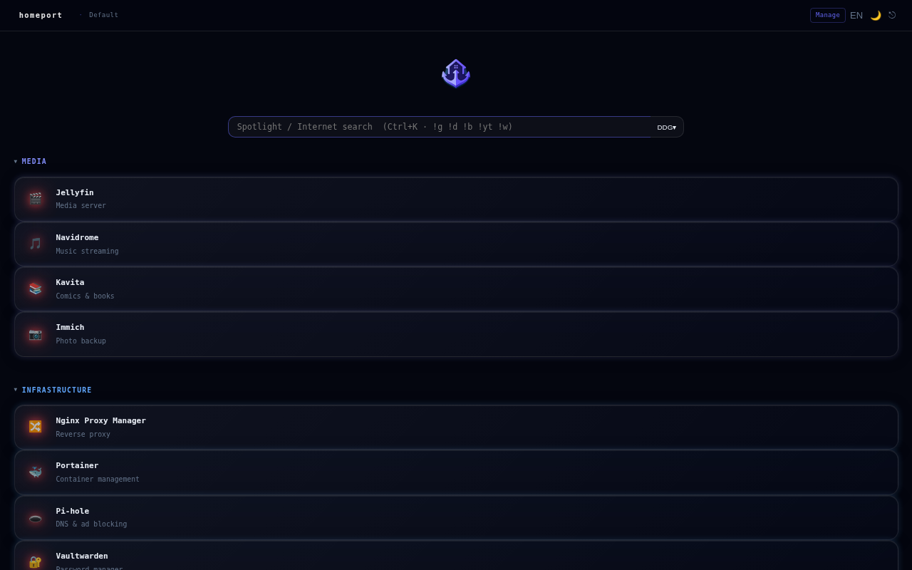
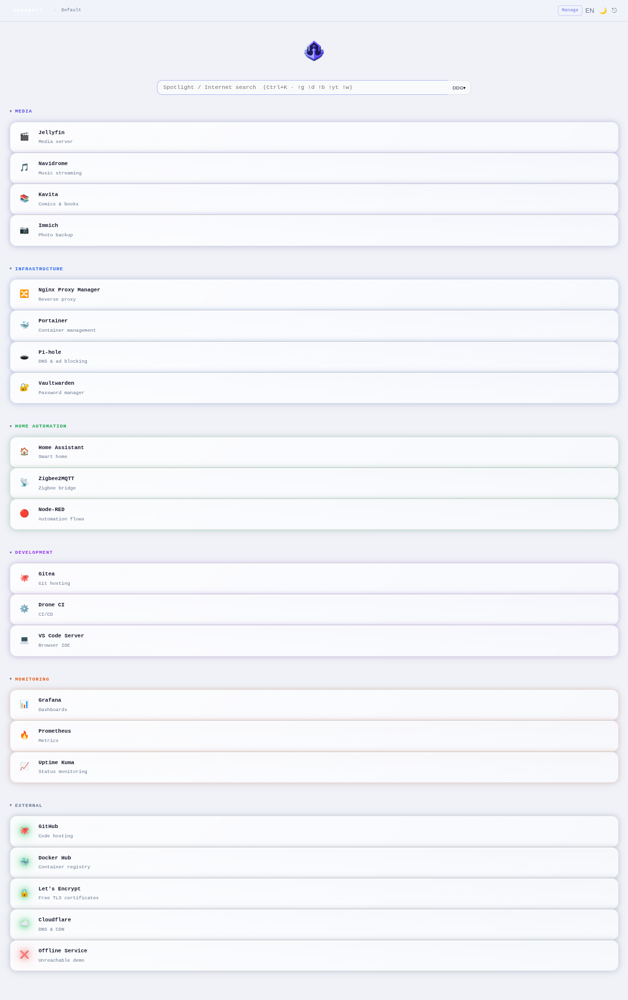
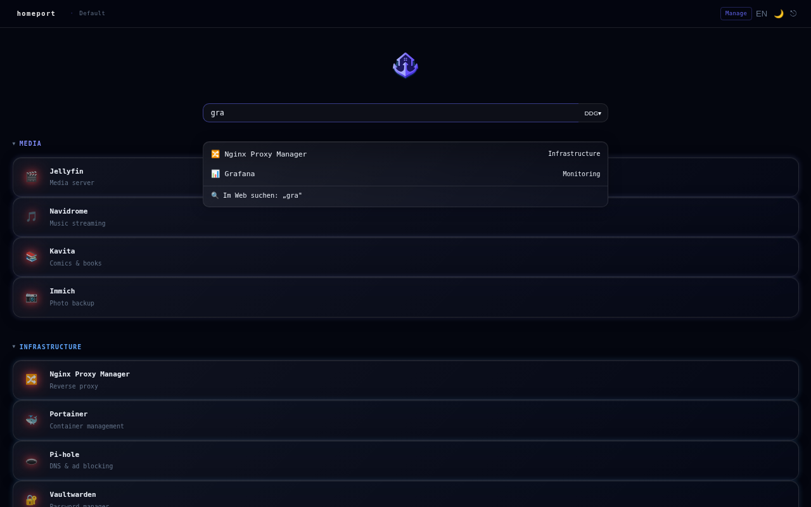
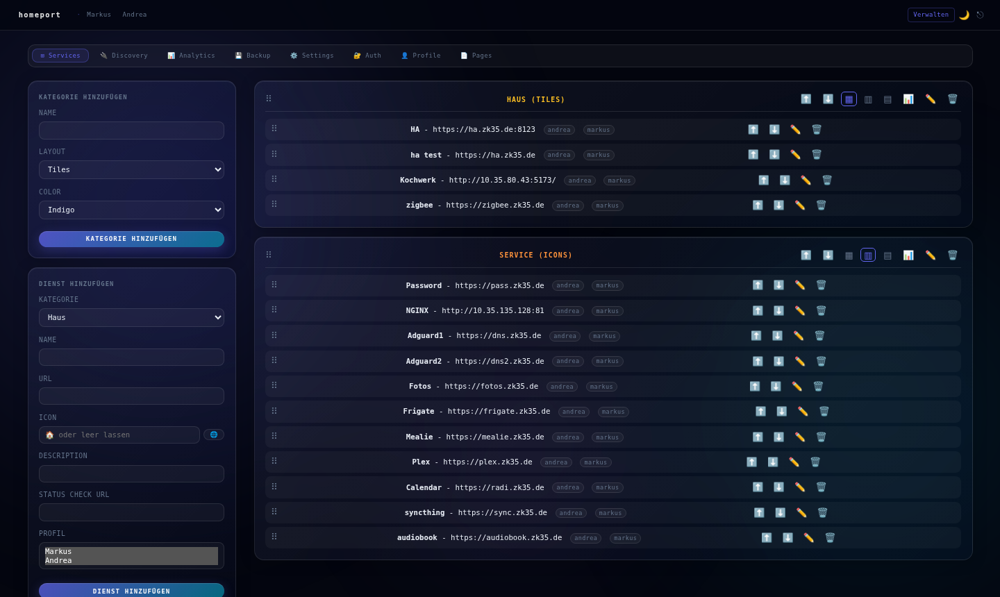
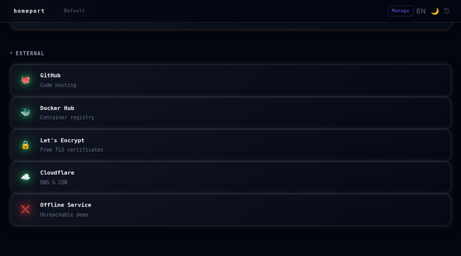
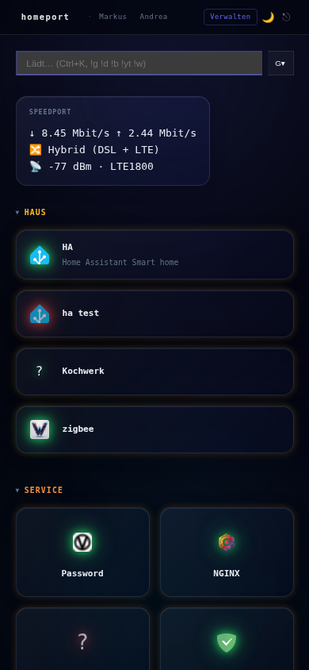

# homeport

Self-hosted startpage for your homelab. Replaces Fenrus/Homer/Dashy.

## Screenshots

| Dashboard (dark) | Dashboard (light) |
|---|---|
|  |  |

| Search spotlight | Manage UI |
|---|---|
|  |  |

| Service status glow | Mobile |
|---|---|
|  |  |

**Why homeport?**
- No config file editing – everything via management Web-UI
- Multi-profile: `/` default, `/{slug}` per user (no login needed)
- **Multi-page layouts**: Work / Personal / Hobby tabs with keyboard shortcuts
- Per-category layout: tiles | list | icons + collapsible + grid span
- Written in Go – single binary, no runtime, minimal attack surface
- Service status indicators (server-side health checks)
- Click-tracking per profile → optional smart sort by usage

## Stack

| Component | Choice |
|-----------|--------|
| Language  | Go 1.23+ |
| Router    | chi v5 |
| DB        | SQLite (modernc, pure Go, no CGO) |
| Frontend  | html/template + HTMX + prism-ui CSS |
| Port      | 8855 |

## Quick Start

```bash
git clone https://github.com/zk35-de/homeport
cd homeport
go build -o homeport ./cmd/homeport
./homeport
```

Open http://localhost:8855, configure at http://localhost:8855/manage

## Environment Variables

| Var | Default | Description |
|-----|---------|-------------|
| `HOMEPORT_PORT` | `8855` | Listen port |
| `HOMEPORT_DB` | `./data/homeport.db` | SQLite DB path |
| `HOMEPORT_BACKUP_DIR` | `./data/backups` | Directory for scheduled backups |
| `HOMEPORT_BACKUP_INTERVAL` | `` | Go duration, e.g. `24h` (empty = disabled) |
| `HOMEPORT_BACKUP_MAX_KEEP` | `7` | Number of backup files to keep |
| `HOMEPORT_AUTH` | `false` | Enable session-based login (`true`/`false`) |
| `HOMEPORT_PUBLIC_PROFILE` | `` | Profile slug accessible without login (e.g. `public`) |
| `HOMEPORT_SESSION_DAYS` | `10` | Cookie lifetime in days |

## Routes

### UI
| Route | Description |
|-------|-------------|
| `GET /` | Default profile dashboard |
| `GET /{slug}` | Profile dashboard by slug |
| `GET /manage` | Management UI |
| `GET /r/{id}?p={profile}` | Click-tracking redirect to service URL |

### Auth
| Route | Description |
|-------|-------------|
| `GET /login` | Login page |
| `POST /login` | Submit credentials (form: `profile`, `password`) |
| `POST /logout` | Invalidate session cookie |
| `GET /manage/auth` | Password management (admin only) |
| `POST /manage/auth/password` | Set password for a profile (form: `profile`, `password`) |
| `POST /manage/auth/password/delete` | Remove password for a profile |

### Management (HTMX)
| Route | Description |
|-------|-------------|
| `POST /manage/service` | Add service |
| `POST /manage/category` | Add category |
| `POST /manage/category/{id}/sortmode/{mode}` | Toggle sort mode (manual\|usage) |
| `POST /manage/category/{id}/span/{span}` | Set grid column span (1\|2\|3) |
| `POST /manage/profile` | Add profile |
| `DELETE /manage/profile/{slug}` | Delete profile |
| `POST /manage/profile/{slug}/default` | Set default profile |
| `POST /manage/profile/{slug}/clone` | Clone profile services |
| `GET /manage/page-list?profile=` | Page list partial (HTMX) |
| `POST /manage/page` | Add page (form: profile, name, icon) |
| `DELETE /manage/page/{id}` | Delete page |
| `PATCH /manage/page/{id}` | Update page name/icon |
| `POST /manage/sort/page/{id}/{direction}` | Reorder page (up\|down) |
| `POST /manage/category/{id}/page/{pageID}` | Assign category to page (0=unassigned) |
| `GET /manage/backup` | Download SQLite snapshot |
| `POST /manage/restore` | Upload & restore backup |
| `GET /manage/analytics` | Click analytics (top-25 per profile) |

### Auto-Discovery
| Route | Description |
|-------|-------------|
| `GET /manage/discovery` | Discovery inbox partial (HTMX) |
| `POST /manage/discovery/{id}/accept` | Accept discovered service (form: `category_id`, `no_check`) |
| `POST /manage/discovery/{id}/ignore` | Ignore discovered service |
| `GET /manage/discovery/sources` | Discovery sources list |
| `POST /manage/discovery/sources` | Add discovery source |
| `DELETE /manage/discovery/sources/{id}` | Delete discovery source |
| `POST /manage/discovery/sources/{id}/toggle` | Enable/disable source |
| `POST /manage/discovery/sources/{id}/scan` | Trigger manual scan |

### API
| Route | Description |
|-------|-------------|
| `GET /api/health` | `{"status":"ok"}` |
| `GET /api/search?q=&profile=` | Full-text search across services |
| `GET /api/user/preferences` | Get preferences |
| `PATCH /api/user/preferences` | Partial update preferences |
| `GET /api/favicon?url=` | Proxy favicon fetch |
| `GET /status/stream` | SSE: service_status events |

## Features

### Service Dashboard
- Categories with layout (tiles / list / icons), color, collapsible, grid span (full / half / third)
- Per-service visibility per profile
- Service status glow (green/red icon glow, health checks every 30s)
- Click-tracking per profile; 📊 toggle per category = sort by usage
- Podman container auto-discovery inbox
- **Auto-Discovery Sources:** NPM, Traefik, and Docker TCP backends, configurable per source

### Login System
- Opt-in via `HOMEPORT_AUTH=true` (default off – backward compatible)
- bcrypt password hashing; first profile to get a password becomes admin
- Session cookie: HttpOnly, SameSite=Lax, configurable lifetime
- CLI password reset: `homeport passwd <profile>` (reads from stdin)
- Admin-only: `/manage/auth` to manage all profile passwords
- `HOMEPORT_PUBLIC_PROFILE=<slug>` – one profile accessible without login

### Auto-Discovery
- Configured sources in `/manage` → Discovery tab
- **Nginx Proxy Manager:** REST API, `identity:secret` auth, auto token-refresh
- **Traefik:** HTTP provider, reads routers
- **Docker TCP:** `GET /containers/json`, labels `homeport.name` / `homeport.url` / `homeport.icon` / `homeport.description`
- Per-source scan interval (seconds), enable/disable toggle, manual scan
- Found services appear in Discovery Inbox (sidebar) for manual review: choose target category, disable health check, accept or ignore

### Search Bar
- **Spotlight search:** results appear inline while typing (DOM-based, no server round-trip)
- **Search engine dropdown** directly on the bar: DuckDuckGo, Google, Brave, Startpage, Bing
- Selected engine persisted per profile
- `Enter` without a selected result → external search in new tab
- Bang syntax: `!g` Google · `!d` DuckDuckGo · `!b` Brave · `!gh` GitHub · `!yt` YouTube · `!w` Wikipedia
- `Ctrl+K` / `/` focuses the search bar from anywhere; `Escape` clears and closes

### Multi-Page Layouts
- Create named pages per profile (Work / Personal / Hobby / …)
- Tab bar appears automatically when pages exist
- Assign categories to pages via manage UI → "Page" dropdown
- Unassigned content (Page 0) appears on **all** tabs
- **Keyboard shortcuts:** `0` / `` ` `` = All, `1`–`9` = page 1–9
- Active tab persisted in `localStorage` per profile
- No page reload – client-side show/hide

### Appearance
- Themes: dark / light / system (toggle in navbar or Settings tab)
- Language: DE / EN (toggle in navbar or Settings tab)
- Accent color picker
- Custom CSS override

### Analytics
- `GET /manage/analytics` – Top-25 most-clicked services per profile
- Profile filter dropdown
- Clicks recorded automatically via `/r/{id}?p={profile}`

### Backup & Restore
- Manual download: `GET /manage/backup` (SQLite VACUUM INTO snapshot)
- Scheduled: set `HOMEPORT_BACKUP_INTERVAL=24h`
- Restore via file upload (validated before swap)

## Data Model

```
profiles         → slug, name, is_default, sort_order
pages            → profile, name, icon, sort_order
categories       → name, layout, color, sort_order, col_span, sort_mode, page_id→pages
services         → category_id, name, url, icon, description, status_check, no_check, sort_order
visibility       → service_id, profile
service_status   → service_id, alive, last_check
service_clicks   → service_id, profile, click_count, last_clicked
user_preferences → profile, theme, accent_color, search_engine, language, custom_css
discovery_inbox  → container_id, external_id, suggested (json), seen_at, ignored, source_id→discovery_sources
discovery_sources → type, name, url, token, enabled, interval, created_at
user_auth        → profile, password (bcrypt), is_admin, created_at, updated_at
sessions         → token, profile, expires_at, created_at
```

## CI/CD

CI workflows in `.gitea/workflows/`:
- `ci.yml` – build + test + vet + govulncheck on every push to `main`
- `release.yml` – linux/amd64 + linux/arm64 binaries + container image on `v*` tags
- Container image: `ghcr.io/zk35-de/homeport:latest` (and `:<tag>`)

## Deploy

Container images are published to `ghcr.io/zk35-de/homeport` on every release.

### Podman Quadlet (systemd, recommended)

```bash
cp deploy/homeport.container ~/.config/containers/systemd/
systemctl --user daemon-reload
systemctl --user start homeport
```

The container file mounts `~/homeport-data` for persistent storage. Adjust
`Volume` and `EnvironmentFile` as needed before starting.

### Docker Compose

```bash
cp deploy/docker-compose.yml .
docker compose up -d          # or: podman compose up -d
```

### Build from source

```bash
go build -o homeport ./cmd/homeport
./homeport
```

### First start

1. Open http://localhost:8855/manage
2. Create your first profile
3. If auth is enabled (`HOMEPORT_AUTH=true`), set a password:
   ```bash
   # Quadlet:
   podman exec -it systemd-homeport homeport passwd <profile>
   # Docker Compose:
   docker compose exec homeport homeport passwd <profile>
   ```
4. The first profile to receive a password becomes admin

### Backup

The SQLite database is at `/app/data/homeport.db` inside the container,
mounted to `~/homeport-data/homeport.db` (Quadlet) or the `homeport-data`
named volume (Compose).

- **Manual:** `GET /manage/backup` → downloads a snapshot
- **Scheduled:** set `HOMEPORT_BACKUP_INTERVAL=24h` → writes to `/app/data/backups/`
  (mount an additional volume if you want backups outside the container)

## Security

- **Open Redirect** protection on `/r/{id}`: non-http(s) target URLs (e.g. `javascript:`, `data:`) → 404
- **XSS**: Go `html/template` auto-escaping enforced; `javascript:` href sanitized to `#ZgotmplZ`
- **Session auth** (`HOMEPORT_AUTH=true`): bcrypt + secure cookie; no session → redirect to `/login`
- **CSRF**: Double-Submit Cookie (`hp_csrf`); all POST/PATCH/DELETE without valid token → 403; HTMX injects token automatically
- **Rate-limiting** on `/login`: 5 attempts / 5 min per IP, then 2s delay; X-Forwarded-For aware
- **Security Headers** on every response:
  - `X-Content-Type-Options: nosniff`
  - `X-Frame-Options: SAMEORIGIN`
  - `Referrer-Policy: strict-origin-when-cross-origin`
  - `Content-Security-Policy`: `default-src 'self'; script-src 'self'; style-src 'self'; img-src 'self' data:; connect-src 'self'; font-src 'self'; frame-ancestors 'self'`
  - No `unsafe-inline` – all templates use CSS classes, no inline `style=""` attributes
- **Note on `/api/favicon`**: proxies favicon fetches server-side; intended for homelab use behind auth or a trusted network
- **Supply chain**: `go.sum` pinned, `govulncheck` in CI, embedded JS assets (htmx, sse.js) served locally

## Dev

```bash
go test ./...              # run tests
go test ./... -cover       # with coverage
go build ./...             # compile all packages
```

**E2E tests** (requires running server on port 8855):

```bash
cd tests/e2e
npm install
npx playwright test
```

No Node.js required for the app itself. Frontend is Go templates + HTMX + embedded CSS.
